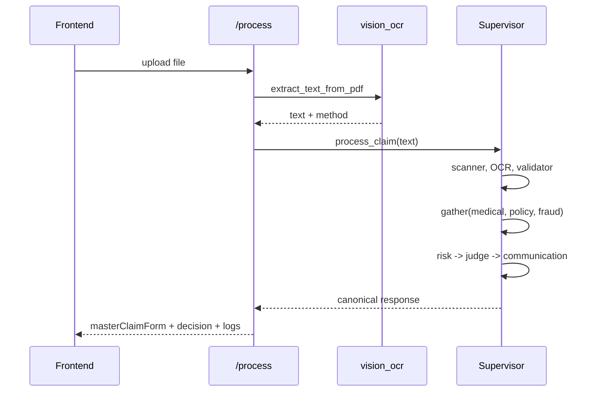

# ClaimBlitz — Project Master Document

> Hackathon-ready technical master document. Every claim below is grounded in the actual codebase (`backend/agentcore/`, `frontend/src/`). Status labels: **IMPLEMENTED**, **PARTIALLY IMPLEMENTED**, **PLANNED**, **NOT IMPLEMENTED**, **UNKNOWN/NEEDS VERIFICATION**.

---

## 1. Executive Summary

**Project name:** ClaimBlitz

**One-line description:** An AI claims-intelligence platform that reads a medical-insurance claim document (typed PDF or scanned image), extracts it into one canonical "Master Claim Form" with full source provenance, runs a collaborative team of 9 specialized AI agents over it, and produces an explainable Approve / Review / Reject recommendation with no fabricated data.

**Problem statement:** Health-insurance claim adjudication is slow, manual, inconsistent, and opaque. A human reviewer must read messy multi-page documents, cross-check policy/clinical/billing details, spot fraud signals, and justify a decision — repeatedly, under time pressure.

**Why it matters:** Claims volume is enormous; manual review is a cost and latency bottleneck; inconsistent decisions create disputes and compliance risk; opaque decisions erode trust.

**Who faces it:** Insurers/TPAs (reviewers, fraud teams), hospital billing desks, and policyholders waiting on decisions.

**Existing solutions & limits:** Rule engines (brittle, can't read free-text/scans), single-LLM "summarize this claim" tools (hallucinate, no provenance, one opaque opinion), and manual review (slow, inconsistent). None give a decomposed, evidence-grounded, auditable decision.

**Our solution:** Document → canonical Master Claim Form (with per-field provenance) → 9 specialized agents (scan, OCR, validate, clinical consistency, policy, fraud, risk, judge, communication) → explainable decision + draft communications. The uploaded document is the single source of truth; missing data is marked MISSING, never invented.

**Core innovation:** (1) A single canonical, provenance-carrying claim schema every agent reasons over; (2) a decomposed risk model (documentation/policy/clinical/billing/fraud) instead of one opaque score; (3) a Judge agent that reconciles disagreement and is barred from auto-approving on low risk or auto-rejecting on missing evidence; (4) a demo-hardened reliability layer (provider key-pool failover, JSON repair/retry, graceful per-agent degradation).

**AI/agentic component:** A Supervisor orchestrates 9 role-specialized agents; the 3 independent analysts run concurrently; a Judge rules; humans are escalated when evidence is insufficient.

**Target users:** Insurer/TPA claim reviewers and fraud analysts; secondarily hospital billing teams.

**Expected impact:** Faster triage, consistent and explainable decisions, and an audit trail — turning a 20-minute manual read into a sub-2-minute assisted decision with evidence.

### 30-second explanation
ClaimBlitz reads an insurance claim — even a scanned one — and turns it into a structured form where every field shows where it came from. Then nine specialized AI agents check the clinical, policy, billing, and fraud angles, debate if they disagree, and a judge agent gives an explainable Approve / Review / Reject. It never makes up data it can't find.

### 1-minute explanation
Claim review today is slow and inconsistent — a human reads messy documents and makes an opaque call. ClaimBlitz automates the heavy lifting without pretending to be a doctor or hiding its reasoning. You upload a claim PDF (typed or scanned). The system OCRs it, extracts a canonical "Master Claim Form" where every value is tagged with its source document, page, confidence, and status (extracted / missing / conflict). Nine specialized agents then reason over that one shared structure: scanner, OCR, validator, clinical-consistency, policy, fraud, risk, judge, and communication. The three independent analysts run in parallel; if they disagree, a debate step runs; a Judge reconciles everything into Approve / Review / Reject with the exact evidence behind it. Crucially, it won't fabricate a policy number or auto-approve just because risk looks low — missing critical evidence routes to human review.

### 3-minute technical explanation
The backend is FastAPI + a `Supervisor` orchestration engine (`agentcore/supervisor.py`). The contract layer (`protocol.py`) and canonical schema (`claim_model.py`) are pure Pydantic — no infra imports — so agents, bus, API, and DB all speak one typed language. Flow: `/process` receives the file → `vision_ocr.extract_text_from_pdf()` uses a text-layer fast path for typed PDFs and an OpenAI-vision OCR path (with Gemini fallback) for scans → the OCR agent builds the Master Claim Form once (code owns status/billing/jurisdiction; the LLM only supplies values) → the Supervisor threads a token-compacted view of that form to each agent. Scanner, OCR, Validator run; then Medical/Policy/Fraud run concurrently via `asyncio.gather`; then Risk composes a decomposed `RiskBreakdown` with blocking conditions; a Judge always runs and reconciles into the final verdict (no low-risk auto-approve override, no auto-reject on missing data). Reliability: an ordered LLM provider pool (OpenAI key #1..#n → Groq → Ollama) fails over automatically; JSON responses are cleaned/repaired and retried; any single agent failure degrades to an ABSTAIN finding and routes the claim to human review rather than crashing. The React/Vite frontend calls `/process` and renders the Master Claim Form with provenance badges, a decomposed risk panel, an agent timeline, and processing logs.

---

## 2. Problem Statement

- **What:** Automate and make explainable the triage/adjudication of medical-insurance claims from real-world documents.
- **Why it exists:** Documents are unstructured (typed PDFs, scanned images, multi-format bills); rules can't read them; humans are slow/inconsistent.
- **Who:** Insurer/TPA reviewers and fraud teams; hospital billing; policyholders indirectly.
- **Frequency:** Continuous, high-volume (every claim submitted).
- **If unsolved:** Backlogs, inconsistent/disputed decisions, fraud leakage, poor auditability.
- **Why current solutions fall short:** Rule engines are brittle and blind to free-text/scans; single-LLM tools hallucinate and give one opaque opinion with no provenance; manual review doesn't scale.
- **Technically hard:** Reading scans (OCR), normalizing wildly varying layouts into one schema without fabricating, decomposing risk, reconciling conflicting signals, and staying auditable.
- **Why it's economically important:** Review labor cost, fraud leakage, dispute/compliance cost, and claim turnaround time are all large levers.

### Problem → Cause → Consequence
| Problem | Root Cause | Consequence |
| --- | --- | --- |
| Slow claim review | Manual reading of unstructured multi-page docs | Backlogs, slow payouts |
| Inconsistent decisions | Human judgment varies; no shared structure | Disputes, compliance risk |
| Opaque decisions | No evidence trail behind a verdict | Low trust, hard to audit |
| Fraud leakage | Hard to spot patterns manually at volume | Financial loss |
| Can't process scans | Rule engines/text tools can't read images | Whole document classes unhandled |

**Why it's a good hackathon problem:** Real, high-value domain; naturally multi-faceted (clinical/policy/billing/fraud) which genuinely justifies specialized agents; demoable end-to-end with a visible, explainable result.

---

## 3. Solution

**Non-technical:** Upload a claim document. ClaimBlitz reads it (even if it's a scan), fills in a structured claim form showing exactly where each value came from, and marks anything it couldn't find as "missing" instead of guessing. A team of AI specialists then checks it from every angle and a "judge" gives a clear recommendation — approve, send to a human, or reject — with the reasons listed.

**Technical:** `POST /process` (file) → text extraction (`vision_ocr`) → canonical `MasterClaimForm` built by the OCR agent → Supervisor pipeline (scanner → OCR → validator → {medical, policy, fraud concurrently} → risk → judge → communication) → canonical response (master form, decomposed risk, decision with blocking conditions and evidence basis, agent findings, debate rounds if any, structured logs, jurisdiction) persisted to the blackboard and returned to the frontend.

- **User interaction:** Upload PDF/image in the dashboard; watch agents light up; read the Master Claim Form + decision.
- **After input:** Extraction → form population → agent reasoning → judge → response.
- **AI involvement:** OCR/vision + 9 reasoning agents (OpenAI `gpt-4o-mini` by default).
- **Data flow:** One canonical form is the shared truth; agents receive a compact view; the judge reconciles.
- **Final output:** Explainable Approve/Review/Reject + draft email/SMS.
- **Error handling:** Provider failover, JSON repair/retry, per-agent ABSTAIN → human review; OCR failure returns a clean actionable message, never a 500.
- **Reliability:** Deterministic code owns status/billing/jurisdiction so the LLM can't fabricate those.

---

## 4. Why This Project Needs an Agentic System

**Honest assessment:** ClaimBlitz is a **genuine multi-agent orchestration**, but with important nuance — it is a **supervised, structured-pipeline multi-agent system**, not a free-roaming autonomous swarm. That is the right design for a regulated, auditable domain.

| Dimension | Traditional rule system | Single LLM | Generic multi-agent | **ClaimBlitz** |
| --- | --- | --- | --- | --- |
| Reads scans/free-text | No | Yes | Yes | Yes (vision OCR) |
| Separates concerns (clinical/policy/fraud) | Hard-coded rules | One blended opinion | Yes | Yes, role-specialized agents |
| Evidence/provenance | Partial | Usually none | Varies | Per-field provenance + per-finding evidence |
| Handles disagreement | N/A | N/A | Sometimes | Debate + Judge reconciliation |
| Auditability | Medium | Low | Varies | Decision path + structured logs |
| Fabrication control | High | Low | Varies | Code-owned fields; MISSING not invented |

- **Why not pure rules:** Can't read messy scans; can't reason about clinical/policy plausibility.
- **Why not a single LLM:** One opaque opinion, high hallucination risk, no separation of concerns, no provenance, no cross-checking.
- **Why specialized agents help:** Each concern (clinical consistency, policy coverage, fraud signals, risk) has a focused prompt and focused evidence, which improves quality and makes the decision explainable per dimension.
- **Autonomy present:** Each agent independently decides a verdict/confidence from the shared form; Risk composes a breakdown; the Judge decides the final outcome and whether to escalate.
- **Tools/context:** Agents receive the compacted Master Claim Form (+ jurisdiction, + peers' findings for Risk/Judge). An `InMemoryAgentMemory` (keyword recall) is wired per agent; a Pinecone semantic memory exists as an option (**PARTIALLY IMPLEMENTED** — default is in-memory keyword matching).
- **Communication/verification:** A typed `MessageBus` exists (`InProcessMessageBus`) and agents can object/vote; in the live `/process` path the Supervisor calls `agent.analyze()` directly and uses debate/judge for verification.
- **Human-in-the-loop:** Insufficient evidence or low confidence → `HumanEscalation` and a REVIEW outcome.

**Where it is less "agentic":** In the live `/process` path the Supervisor drives agents directly (not an emergent bus conversation), and most agents don't call external tools. This is a deliberate reliability/latency choice for a demo and a regulated domain. The bus-based peer messaging is **PARTIALLY IMPLEMENTED / used mainly in debate**.

---

## 5. Complete Agent Inventory

All 9 agents are **IMPLEMENTED** and execute in the live pipeline (`agentcore/agents/`, orchestrated by `supervisor.py`). Enum roster in `protocol.AgentRole` is 10 (the 9 below + `SUPERVISOR`, the orchestrator).

### Agent: Scanner (`AgentRole.SCANNER`)
- **Purpose/Responsibility:** Document intake triage — is this a processable claim document?
- **Input:** File metadata enriched with extracted-text signals (length, preview). **Output:** `AgentFinding` (approve/reject) with quality/type.
- **Tools:** None. **Model:** OpenAI `gpt-4o-mini` (via LLM client). **Prompt:** Judges on extracted text, not file size.
- **Memory:** Per-agent in-memory keyword recall. **Decisions:** processable vs not (advisory — does not hard-stop pipeline).
- **Dependencies:** LLM. **Communication:** Supervisor direct call. **Failure:** ABSTAIN finding → pipeline continues. **Retry/Timeout/Fallback:** LLM-level provider failover + parse retry. **Verification:** downstream agents. **Status:** IMPLEMENTED.
- **Why separate:** Intake triage is a distinct concern from extraction.

### Agent: OCR / Extraction (`AgentRole.OCR`)
- **Purpose:** Turn raw document text into the canonical Master Claim Form (values only; code assigns status/billing/jurisdiction).
- **Input:** `raw_text`. **Output:** `(MasterClaimForm, extracted_dict)` + an extraction `AgentFinding`.
- **Tools:** PyMuPDF upstream for text; the agent itself is an LLM extractor. **Model:** `gpt-4o-mini`. **Prompt:** Large nested schema; "only report values literally present; never infer."
- **Memory:** in-memory. **Decisions:** which fields are present/missing; approves unless no text. **Failure:** ABSTAIN → all-MISSING baseline (no fabrication). **Retry:** `build_master_form` retries up to 3× if the form comes back empty while text exists. **Status:** IMPLEMENTED.
- **Why separate:** Extraction is the backbone every other agent depends on.

### Agent: Validator (`AgentRole.VALIDATOR`)
- **Purpose:** Structural/consistency checks categorized into document validity, completeness, consistency (dates/identity/diagnosis/provider/bill), coding (jurisdiction-aware), billing arithmetic, cross-document conflicts.
- **Output:** `AgentFinding` with issue list; never auto-REJECTs on missing data. **Status:** IMPLEMENTED.
- **Why separate:** Structural validity is distinct from clinical/policy judgment.

### Agent: Clinical Consistency (`AgentRole.MEDICAL_EXPERT`, display name "Clinical Consistency Agent")
- **Purpose:** Diagnosis/document consistency, diagnosis-code plausibility, treatment/procedure/diagnosis consistency. Not a diagnostician; must cite evidence.
- **Note:** Enum value kept as `medical_expert` for compatibility; surfaced as "Clinical Consistency Agent" via `AGENT_DISPLAY_NAMES`. **Status:** IMPLEMENTED.

### Agent: Policy Expert (`AgentRole.POLICY_EXPERT`)
- **Purpose:** Coverage grounded in actual policy evidence. If no policy document → `INSUFFICIENT_EVIDENCE` (short-circuits before the LLM). Never invents clauses. Outcomes: COVERED / NOT_COVERED / PARTIALLY_COVERED / INSUFFICIENT_EVIDENCE / HUMAN_REVIEW. **Status:** IMPLEMENTED.

### Agent: Fraud Detection (`AgentRole.FRAUD_DETECTION`)
- **Purpose:** Real-signal fraud indicators only (duplicates, conflicting IDs, inconsistent dates). Drops amount-only "high bill = fraud" signals; emits an explicit "no direct fraud evidence" string when clean. **Status:** IMPLEMENTED.

### Agent: Risk Assessment (`AgentRole.RISK_ASSESSMENT`)
- **Purpose:** Compose a decomposed `RiskBreakdown` (documentation / policy / clinical / billing / fraud / overall) with role-keyed blocking conditions. Runs after peers so it can read their findings. **Status:** IMPLEMENTED.
- **Why separate:** Risk synthesis depends on all other analysts' outputs.

### Agent: Judge (`AgentRole.JUDGE`)
- **Purpose:** Always runs; reconciles all findings/evidence/conflicts/confidences into Approve/Review/Reject. Guard: blocking conditions force REVIEW; never auto-approve on low risk; never auto-reject solely on missing data. **Status:** IMPLEMENTED (always-run `_run_judgment`).
- **Why separate:** A single accountable reconciliation point is essential for an auditable final decision.

### Agent: Communication (`AgentRole.COMMUNICATION`)
- **Purpose:** Draft policyholder email/SMS from the final structured decision only; "additional documentation required" language for REVIEW. **Status:** IMPLEMENTED.

---

## 6. Agent Responsibility Matrix

| Agent | Responsibility | Input | Output | Tools | Model | DB | Depends On | Failure Strategy |
| --- | --- | --- | --- | --- | --- | --- | --- | --- |
| Scanner | Intake triage | file meta + text signals | approve/reject finding | — | gpt-4o-mini | blackboard | LLM | ABSTAIN, continue |
| OCR | Build Master Claim Form | raw_text | form + finding | PyMuPDF (upstream) | gpt-4o-mini | — | LLM | ABSTAIN, all-MISSING; retry 3× |
| Validator | Structural/consistency | compact form | issues finding | — | gpt-4o-mini | — | OCR | ABSTAIN, continue |
| Clinical Consistency | Clinical/diagnosis consistency | compact form | finding | — | gpt-4o-mini | — | OCR | ABSTAIN |
| Policy | Coverage vs policy evidence | compact form | finding (+INSUFFICIENT_EVIDENCE) | — | gpt-4o-mini | — | OCR | short-circuit/ABSTAIN |
| Fraud | Real-signal fraud | compact form | finding | — | gpt-4o-mini | — | OCR | ABSTAIN |
| Risk | Decomposed risk | compact form + peer findings | RiskBreakdown finding | — | gpt-4o-mini | — | Medical/Policy/Fraud | ABSTAIN |
| Judge | Final reconciliation | all findings + risk | ruling | — | gpt-4o-mini | — | all analysts | None→REVIEW fallback |
| Communication | Draft messages | decision + form | drafts | — | gpt-4o-mini | — | Judge | template fallback |

**Plain language:** The Supervisor is a workflow controller. It feeds every agent the same structured claim, runs the three independent opinions at once, lets Risk summarize them, and lets the Judge make the final, explainable call — escalating to a human when evidence is thin.

---

## 7. Agent Communication System

- **Primary mechanism (live path):** **Direct in-process async method calls** — the Supervisor awaits `agent.analyze(...)`. Independent analysts via `asyncio.gather`. **IMPLEMENTED.**
- **Typed message bus:** `InProcessMessageBus` (`bus.py`) with typed `AgentMessage` envelopes; agents subscribe on construction; used for objections/votes in debate. **PARTIALLY IMPLEMENTED** (present and wired; debate uses votes; peer Q&A is light in the live path).
- **Shared working memory ("blackboard"):** `InMemoryBlackboard` by default; `RedisBlackboard` for non-dev. Stores stage, raw_text, file_meta, and the canonical response for the GET endpoints. **IMPLEMENTED** (in-memory active; Redis path PARTIALLY — requires Redis + non-dev env).
- **Not used in live orchestration:** HTTP/WebSocket/Kafka/Celery/MCP for agent-to-agent. (Celery/RabbitMQ exist as **PLANNED/scaffolding**.)

**Why direct calls:** Lowest latency, deterministic ordering, trivially debuggable, and failure isolation per agent — ideal for a reliable demo and a regulated audit trail. **Trade-off:** less "emergent," but far more predictable.

### Agent Communication Flow (actual)
```text
User → Frontend → POST /process → vision_ocr (text layer or OpenAI vision)
   → OCR builds MasterClaimForm → Supervisor
     → Scanner → OCR-finding → Validator
     → gather(Medical, Policy, Fraud)   (concurrent)
     → Risk (reads peer findings) → Judge (reconciles) → Communication
   → canonical response → Blackboard → Frontend → User
```

---

## 8. Communication Protocol

Defined in `protocol.py` (pure Pydantic). Core envelope `AgentMessage`: `message_id`, `type` (REQUEST/RESPONSE/ASSERTION/OBJECTION/VOTE/…), `sender`, `recipient`, `claim_id`, `correlation_id`, `causation_id`, `trace_id`, `priority`, `payload`, `created_at`.

Core opinion `AgentFinding`: `id`, `agent`, `claim_id`, `verdict` (approve/reject/flag/abstain), `confidence` (`ConfidenceScore{value, rationale}`), `reasoning`, `evidence[]` (`Evidence{source, field, snippet, citation, weight}`), `referenced_fields`, `tags`, `created_at`.

Field provenance (`claim_model.FieldProvenance`): `{field, value, source_document, page, confidence, status∈{EXTRACTED,MISSING,CONFLICT,VERIFIED,LOW_CONFIDENCE}, conflicts[], note}`.

**Why structured JSON over free text:** typed, auditable, machine-checkable, and the basis of explainability (every verdict carries evidence; every field carries provenance).

---

## 9. Failure Rate & Reliability Analysis

> **No empirical failure-rate measurement is currently available.** The system has not been benchmarked under load. The table below is a qualitative framework; probabilities are **ESTIMATES**, explicitly labeled.

| Component | Failure Mode | Probability (est.) | Impact | Detection | Recovery |
| --- | --- | --- | --- | --- | --- |
| LLM API | Rate limit (429) | High on free tier | Agent stalls/fails | Exception in client | Key-pool failover → Groq → Ollama |
| LLM API | Invalid/expired key (401) | Medium | Agent fails | Exception | Failover to next pooled key |
| LLM output | Malformed/truncated JSON | Medium | Parse failure | `parse_json_response` raises | Repair + up to 3 retries |
| Vision OCR | Transient 503/429 | Medium | OCR page fails | HTTP code | Backoff retry; OpenAI→Gemini failover |
| Vision OCR | Scan has no text + no provider | Low | No extraction | empty text | Clean 400, graceful message (no 500) |
| Agent | Any exception | Low–Medium | One opinion missing | try/except in Supervisor | ABSTAIN finding → human review |
| MongoDB | Unreachable | Medium (demo) | No persistence | connection error | In-run blackboard fallback (non-fatal) |
| Network | Drop mid-call | Env-dependent | Call fails | socket error | Retry/failover; else ABSTAIN |

**To measure for real (framework):** wrap each agent call with timing + success/failure counters; aggregate per-agent success rate, median/95p latency, retry counts, and failover frequency over N claims; log to the audit trail.

---

## 10. Failure Handling Architecture

- **Provider key pool + failover (`AsyncLLMClient`):** ordered providers (OpenAI key#1..#n → Groq → Ollama); tries next on any failure. *Why:* a single dead/rate-limited key never surfaces an error. *Without it:* one bad key kills the demo. *Alternatives:* single key (fragile), external gateway (overkill). **IMPLEMENTED.**
- **JSON repair + retry (`json_cleaner`, client loop):** strips fences, extracts/balances objects, retries up to 3×; also retries empty responses. *Why:* small models occasionally emit imperfect JSON. **IMPLEMENTED.**
- **OpenAI JSON mode (OpenAI endpoints only):** reliable native `json_object`; deliberately NOT used on Groq (its strict mode hard-rejects). **IMPLEMENTED.**
- **Per-agent graceful degradation:** exceptions → synthesized ABSTAIN finding tagged `agent_unavailable` → routes to REVIEW. *Why:* one agent failing must not fail the claim. **IMPLEMENTED.**
- **Always-run Judge + None→REVIEW fallback:** decision never silently defaults to approve. **IMPLEMENTED.**
- **Vision OCR backoff + provider failover + per-page empty tolerance.** **IMPLEMENTED.**
- **Blackboard fallback:** in-memory if Redis absent; Mongo persistence optional and non-fatal. **IMPLEMENTED (in-memory).**
- **Circuit breaker / dead-letter queue / alerting:** **NOT IMPLEMENTED** (PLANNED for production).

---

## 11. Database Deep Analysis

Storage actually referenced in code:

- **MongoDB (motor async)** — `db/engine.py`, `db/repos.py`. Collections: `claims`, `findings`, `workflows`, `escalations`, `audit_log`. *Stores:* claim records, findings, workflow snapshots, escalations, append-only audit trail. *Status:* **IMPLEMENTED but OPTIONAL** — the live `/process` path persists via the blackboard and tolerates Mongo being unreachable; repos are used by GET endpoints (e.g. audit trail) with in-run fallback. Connection string present in `.env`.
- **Blackboard (in-memory default; Redis optional)** — `blackboard.py`. Fast per-claim scratchpad + the stored canonical response. *Status:* **IMPLEMENTED (in-memory)**, Redis **PARTIALLY** (non-dev env).
- **Pinecone / vector memory** — `pinecone_memory.py` exists; default agent memory is `InMemoryAgentMemory` (keyword). *Status:* **PARTIALLY IMPLEMENTED** (optional).
- **PostgreSQL** — DSN still in `.env` and an Alembic migration dir exists, but the engine was replaced by Mongo. *Status:* **NOT IMPLEMENTED / legacy leftover** (see Audit §49).
- **Supabase** — keys present in `.env`; **UNKNOWN/NEEDS VERIFICATION** — not referenced by the agentcore pipeline I inspected (likely leftover).

**Why MongoDB:** claim data is deeply nested JSON (findings, decision paths, debate rounds, provenance) that maps 1:1 to documents — no ORM impedance. **Why Redis blackboard:** sub-ms shared scratchpad for the tight orchestration loop + pub/sub for progress. **Why vector DB (optional):** semantic recall of similar past claims/fraud patterns; not required for the core decision.

- *Why Mongo not Postgres?* Nested, schema-flexible claim docs; no relational joins needed on the hot path.
- *Why Redis not Mongo for working state?* Latency and TTL/pub-sub for in-flight orchestration.
- *Why Pinecone not relational?* Semantic similarity, not exact match.

---

## 12. Database Decision Matrix

| Requirement | Selected | Alternative | Why selected | Why alternative rejected |
| --- | --- | --- | --- | --- |
| Persist nested claim/findings/audit | MongoDB | PostgreSQL | Document-native JSON | Relational modeling overhead for nested data |
| Fast in-flight working state + pub/sub | Redis blackboard (in-mem default) | Postgres | Low latency, TTL, events | Too slow for the orchestration loop |
| Semantic recall (optional) | Pinecone | pgvector/FAISS | Managed vector search | Extra ops for a non-core feature |
| Hot-path decision | Blackboard response cache | DB read each call | Serve GET endpoints without re-running | Re-running the pipeline is expensive |

Simplicity note: for the hackathon the system runs fully on the **in-memory blackboard** with Mongo/Redis/Pinecone all optional — fewer moving parts to fail on stage.

---

## 13. Data Model (key entities)

- **MasterClaimForm** (`claim_model.py`): 12 sections — Claim Info, Patient, Policy, Provider, Hospitalization, Clinical, Procedures[], Investigations[], Medications[], Billing (line items + submitted/calculated totals + flag), Supporting Documents, plus `jurisdiction`. Every scalar is a `FieldProvenance`. Helpers: `all_fields()`, `missing_fields()`, `conflict_fields()`.
- **FieldProvenance:** `field, value, source_document, page, confidence, status, conflicts[], note`.
- **RiskBreakdown:** per-dimension `RiskDimension{score, band, drivers[]}` for documentation/policy/clinical/billing/fraud/overall + `blocking_conditions[]`.
- **AgentFinding / ConfidenceScore / Evidence / DecisionPath / DecisionStep / DebateRound / Vote / JudgeRuling / HumanEscalation** (`protocol.py`).
- **Mongo docs:** `claims`, `findings`, `workflows`, `escalations`, `audit_log` (see §11).

Relationships: one claim → many findings → one workflow snapshot → optional escalation → many audit steps. Sensitive data: patient PII inside claim docs (see Security §20).

---

## 14. Complete Data Flow
```text
User upload (PDF/image)
 → Frontend (useClaimAgent) POST /process (FormData file)
 → routes._extract_text → vision_ocr.extract_text_from_pdf
       text layer? → use it (fast, no API)
       scanned?    → OpenAI gpt-4o-mini vision OCR (Gemini fallback), page-capped
 → OCR agent build_master_form (values from LLM; code sets status/billing/jurisdiction; retry if empty)
 → Supervisor threads compact form to agents
 → Scanner → OCR finding → Validator
 → gather(Medical, Policy, Fraud)
 → Risk (RiskBreakdown + blocking conditions)
 → Judge (final verdict; blocking→REVIEW; no auto-approve/reject)
 → Communication (drafts)
 → _build_process_response (masterClaimForm, riskBreakdown, decision, provenanceSummary,
      agentFindings, debate, logs incl. OCR method, jurisdiction, legacy keys)
 → Blackboard store → JSON to Frontend → render
```

---

## 15. API Architecture (`agentcore/api/`)

Router mounted at both `/` and `/v2` (one handler, two mount paths); CORS `*`. Key endpoints:

| Endpoint | Method | Purpose | Status |
| --- | --- | --- | --- |
| `/process` | POST | Upload + run full pipeline (frontend path) | IMPLEMENTED |
| `/health`, `/health/agents` | GET | Health; agent roster (10) | IMPLEMENTED |
| `/claims/upload` | POST | Store claim (no run) | IMPLEMENTED |
| `/claims/{id}/extract` | POST | Scanner+OCR only | IMPLEMENTED |
| `/claims/{id}` | GET | Status | IMPLEMENTED |
| `/claims/{id}/master-form` | GET | Master form | IMPLEMENTED |
| `/claims/{id}/validate` | POST | Validation | IMPLEMENTED |
| `/claims/{id}/process` | POST | Run on stored claim | IMPLEMENTED |
| `/claims/{id}/findings` | GET | Findings | IMPLEMENTED |
| `/claims/{id}/decision` | GET | Judge decision | IMPLEMENTED |
| `/claims/{id}/logs` | GET | Structured logs (audit trail or in-run) | IMPLEMENTED |
| `/claims/{id}/reprocess` | POST | Re-run | IMPLEMENTED |
| `/v2/claims` + pause/resume/retry/escalations | — | Workflow mgmt | PARTIALLY (escalations are placeholders) |

Auth/rate-limiting on these endpoints: **NOT IMPLEMENTED** (dev-open; see Security).

---

## 16. Frontend Analysis (`frontend/src/`)

- **Framework:** React 18 + Vite 8, Tailwind 4, framer-motion, lucide-react, react-router-dom.
- **Pages:** `Dashboard.jsx` (main workspace), `SubmissionPage`, `LandingPage`, `InsurerPortalPage`.
- **Key components (`components/claimbitz/`):** `MasterClaimForm` + `SectionCard` + `ProvenanceBadge` (12 sections, ✓/⚠ status, source+page, conflicts), `RiskPanel` (decomposed bars + decision basis), `AgentTimeline` (9-agent roster, logs-driven), `ProcessingLogs` (structured rows incl. OCR method), `DashboardDocumentViewer`, `ResolutionLayer`, `RiskRing`, `GeneratedOutput`, `BootSplash`.
- **State:** `hooks/useClaimAgent.js` — upload, POST `/process`, reconcile agent step state from `data.logs` (an agent shows done/error only if it actually ran), Demo Mode (synthetic low/medium/high, labeled SYNTHETIC DEMO).
- **API integration:** `fetch(${VITE_API_BASE_URL||'http://localhost:8000'}/process)` with FormData.
- **Loading/error states:** agent timeline + processing logs; error surfaced in console panel. **Accessibility/responsive:** Tailwind-based; full WCAG audit **NOT VERIFIED**.

---

## 17. Backend Architecture

- **Framework:** FastAPI (`api/app.py` factory, lifespan, CORS).
- **Structure:** `protocol.py` (contracts) + `claim_model.py` (schema) are pure Pydantic; `supervisor.py` orchestrator; `agents/` (9); `llm.py` (provider pool); `vision_ocr.py`; `blackboard.py`; `bus.py`; `memory.py`; `db/` (motor + repos); `tools.py`; `security.py`, `observability.py` (scaffolding).
- **Orchestration:** `Supervisor.process_claim()` state machine (INGESTED→SCANNING→OCR→VALIDATION→PARALLEL_ANALYSIS→[DEBATE]→JUDGMENT→COMMUNICATION→COMPLETED/REJECTED/HUMAN_ESCALATION/FAILED).
- **Background jobs/WebSockets/caching:** Celery/RabbitMQ **PLANNED**; blackboard pub/sub exists but no live SSE wired in `/process`.
- **Why FastAPI:** async-native (matches concurrent agent calls + async Mongo/HTTP), Pydantic-first (matches the typed protocol), minimal boilerplate.

---

## 18. AI/ML Architecture

- **Primary model:** OpenAI `gpt-4o-mini` for all 9 agents and for vision OCR (image input). `temperature≈0.1` for agents, `0.0` for OCR; agent `max_tokens` default 2500, OCR 8000.
- **Fallbacks:** Groq (`openai/gpt-oss-20b`, OpenAI-compatible) then Ollama (local) via the provider pool.
- **Embeddings:** `text-embedding-3-small` (1536-dim) for optional Pinecone memory.
- **Failure modes:** rate limits, malformed JSON, empty reasoning-token responses — all handled (failover + repair + retry).

| Requirement | Selected | Alternative | Reason |
| --- | --- | --- | --- |
| Fast, cheap, reliable JSON + vision | gpt-4o-mini | Groq gpt-oss-20b | Reliable JSON mode + native vision; Groq free tier rate-limited & text-only here |
| Zero-cost local fallback | Ollama (llama3.x) | — | Offline resilience; too slow on 6GB GPU for the full pipeline (tested) |
| Vision OCR | gpt-4o-mini vision | Gemini / Tesseract | Reuses working key; Gemini kept as fallback; Tesseract lower accuracy |

---

## 19. RAG / Knowledge System

**PARTIALLY IMPLEMENTED.** There is agent memory (`InMemoryAgentMemory` keyword recall by default; Pinecone semantic memory optional via `pinecone_memory.py` + OpenAI embeddings). There is **no document-ingestion RAG pipeline** (no chunking/vector index of policy manuals feeding generation). The policy agent is grounded in the uploaded policy evidence, not a retrieved knowledge base. If asked: "We use optional vector memory for similar-case recall; we deliberately do not RAG over external policy corpora yet — coverage decisions are grounded only in the submitted policy document to avoid hallucinated clauses."

---

## 20. Security Architecture

| Threat | Risk | Mitigation / Status |
| --- | --- | --- |
| Prompt injection via document text | Medium | Code owns status/billing/jurisdiction; LLM supplies values only; "never infer" prompts. Partial. |
| PII in medical docs | High | Kept in claim docs; **no field-level encryption/redaction yet** — PLANNED. |
| Secrets in `.env` | High | `.env` gitignored; keys only local. **Keys were pasted in chat during dev → rotate after event.** |
| Unauthed API | High | Endpoints are dev-open; **auth/RBAC NOT IMPLEMENTED** on routes (JWT settings exist, unused). |
| Rate limiting | Medium | Not enforced server-side; provider-side limits only. NOT IMPLEMENTED. |
| File upload abuse | Medium | Type sniffed via PyMuPDF; **no size/scan limits** beyond page cap. Partial. |
| Fabricated clinical/policy data | High (domain) | No-fabrication design: MISSING/CONFLICT/INSUFFICIENT_EVIDENCE explicit. IMPLEMENTED. |
| SQL injection | N/A | No SQL on hot path (Mongo + Pydantic). |

**Do not claim HIPAA/DPDP/IRDAI compliance** — none exists. Use "designed with security and auditability controls."

---

## 21. Technology Stack
- **Frontend:** React 18, Vite 8, Tailwind 4, framer-motion, lucide-react, react-router-dom.
- **Backend:** Python 3.11, FastAPI, Pydantic v2 / pydantic-settings, httpx, tenacity, PyMuPDF (`fitz`), openai SDK, motor.
- **AI:** OpenAI gpt-4o-mini (agents + vision) → Groq → Ollama fallback; text-embedding-3-small.
- **Data:** MongoDB (optional/active), in-memory blackboard (Redis optional), Pinecone (optional).
- **Infra/Deploy:** Dockerfile + docker-compose present; k8s manifests referenced in ARCHITECTURE. Local run = uvicorn + Vite.
- **Auth/Monitoring:** scaffolding only (JWT settings, observability.py) — NOT wired.

---

## 22. Technology Decision Analysis (selected)
- **FastAPI:** async for concurrent agents + async Mongo/HTTP; Pydantic matches the typed protocol. Remove it → rebuild async + validation plumbing. 10×/100× → add workers/queue (Celery scaffolding exists).
- **gpt-4o-mini:** cheapest reliable JSON + vision model; pennies per claim. Remove → lose reliable JSON/vision. 100× → batch, cache, raise tier.
- **MongoDB:** nested claim docs; no ORM. 100× → sharding/indexes on claim_id/stage.
- **In-memory blackboard default:** fewest moving parts for the demo. 100× → Redis (already coded).
- **Provider key pool:** demo resilience. Scale → central gateway/budgeting.

---

## 23. Why Not Other Technologies (relevant only)
- **Mongo vs Postgres:** nested JSON claim docs → document store; relational joins not on hot path.
- **FastAPI vs Django:** async-first + Pydantic; no need for Django ORM/admin.
- **In-memory/Redis vs Kafka:** single-node orchestration; Kafka is overkill at hackathon scale.
- **Hosted LLM vs local:** local 8B too slow on 6GB GPU (empirically tested this build); hosted gpt-4o-mini is fast/cheap. Ollama kept only as offline last resort.
- **Multi-agent vs single LLM:** domain genuinely has separable concerns (clinical/policy/billing/fraud) + need for per-dimension explainability and disagreement handling.
- **Vision LLM vs Tesseract:** higher accuracy on messy scans + can structure in one step.

---

## 24. Infrastructure
Current: local dev (uvicorn :8000, Vite :5173), MongoDB Atlas (cloud) optional, OpenAI/Groq APIs, optional Pinecone/Redis. Dockerfile + docker-compose present. SSL/CDN/DNS/queue/monitoring: **PLANNED/NOT IMPLEMENTED** for production.

## 25. Deployment Architecture
```text
User → (prod: DNS/SSL/CDN) → Frontend (Vite build/static)
     → FastAPI (uvicorn/gunicorn) → Supervisor + agents
     → MongoDB Atlas (persistence)  → OpenAI/Groq (LLM/vision)
     → (optional) Redis blackboard, Pinecone memory
```
CI/CD, health-check-driven rollout, autoscaling: **PLANNED**. Secrets via env. Health endpoints exist.

---

## 26. Real-World Use Cases
1. **TPA first-pass triage** — reviewer uploads claim; gets Master Form + REVIEW with reasons → focuses only on flagged items. Beats manual reading.
2. **Fraud analyst screening** — real-signal fraud findings (not "big bill = fraud") prioritize investigations.
3. **Hospital billing pre-check** — billing arithmetic consistency catches mismatches before submission.
4. **Scanned-document intake** — vision OCR ingests paper/scanned claims rule engines can't read.
5. **Audit/compliance** — decision path + per-field provenance give a defensible trail per decision.

## 27. Business Value
Payers: fewer review hours, consistent/auditable decisions, fraud leakage reduction. Hospitals: fewer rejections via pre-checks. Value = labor saved + leakage reduced + faster turnaround. Models: per-claim SaaS, seat-based for reviewers, enterprise on-prem for data residency.

## 28. Scalability
- **100:** single node fine.
- **1k:** add Redis blackboard, Mongo indexes, LLM concurrency limits.
- **10k:** queue (Celery/RabbitMQ scaffolding), horizontal API workers, provider budgeting/caching.
- **100k:** sharded Mongo, autoscaled stateless workers, batched/queued LLM, dedicated OCR workers, observability + circuit breakers.
Bottlenecks in order: LLM throughput/cost, OCR cost, Mongo write volume.

## 29. Performance
> **No formal benchmarks.** Observed in dev this session: synthetic (text-layer) claim ≈ 90–100s end-to-end; real scan (2 pages OCR + agents) ≈ 30–80s. Latency dominated by sequential LLM calls (now 3 analysts concurrent). Benchmark method: time each stage over N claims, record p50/p95, retries, failover counts.

## 30. Cost (ESTIMATES — gpt-4o-mini is low-cost)
- **Prototype:** pennies/claim; free Mongo Atlas tier.
- **1k claims/day:** low single-digit $/day LLM + OCR (estimate).
- **10k:** paid LLM tier + Redis + indexes.
- **100k:** largest line item is LLM/OCR tokens; add caching/batching.
Mark all as estimates — depends on tokens/page counts.

## 31. Observability
Implemented: structured step logs (`_step_logs`) with agent/action/status/summary + OCR method; decision path; `audit_log` collection + `/claims/{id}/logs`. Request/trace/correlation IDs exist in the protocol envelope. Missing: metrics/traces export, alerting, dashboards (`observability.py` scaffolding). Debugging "wrong answer": pull the claim's logs + agentFindings + decision basis + provenance to see exactly which agent concluded what from which field.

## 32. Testing
27 backend tests pass (`pytest`): health/roster, 10 required pipeline cases (TC1–TC10 + TC-COMM + TC-JUDGE1) with LLM mocked, Master Claim Form provenance/MISSING/CONFLICT, jurisdiction inference, billing-sum smoke, and **vision OCR failover tests** (text-layer fast path, OpenAI→second-key→Gemini failover, page cap, no-provider error, retry). Frontend: 16 vitest tests (9-agent roster, logs-driven completion, no-compliance-claims scan, SYNTHETIC DEMO label, MISSING/CONFLICT badges). Missing: load/security/live-API integration tests.

## 33. Edge Cases
| Edge case | Current behavior | Ideal | Status |
| --- | --- | --- | --- |
| Empty/garbled PDF | Clean 400 message | Same | IMPLEMENTED |
| Scanned PDF | OpenAI vision OCR (Gemini fallback) | Same | IMPLEMENTED |
| Missing policy doc | INSUFFICIENT_EVIDENCE → REVIEW | Same | IMPLEMENTED |
| Billing mismatch | Flagged, not auto-reject | Same | IMPLEMENTED |
| Conflicting dates | CONFLICT status preserved | Same | IMPLEMENTED |
| One agent fails | ABSTAIN → REVIEW | Same | IMPLEMENTED |
| All LLM keys fail | Failover → Groq → Ollama; else graceful error | Same | IMPLEMENTED |
| LLM malformed JSON | Repair + retry 3× | Same | IMPLEMENTED |
| Concurrent uploads | Works; shares provider rate limit | Queue/throttle | PARTIAL |

## 34. Known Limitations (honest)
- Free-tier LLM rate limits (10 RPM) throttle a 9-agent pipeline; needs paid tier or multi-account pool for smooth concurrency.
- No API auth/rate limiting; dev-open.
- No PII encryption/redaction.
- MongoDB/Redis/Pinecone optional and not required by the hot path (persistence may be skipped if Mongo is down).
- No RAG over policy corpora.
- Latency is tens of seconds per claim (sequential LLM calls).
- Legacy artifacts (Postgres DSN, Supabase keys, Celery/k8s scaffolding) not used by the live path.
- No load/security benchmarks.

## 35. Current vs Production Architecture
- **Current:** uvicorn + Vite; in-memory blackboard; optional Mongo; OpenAI pool→Groq→Ollama; no auth; synchronous per-request pipeline.
- **Production:** auth/RBAC + rate limiting; Redis blackboard; Mongo w/ indexes+backups; queue + worker pool; LLM gateway w/ budgeting + caching; observability (metrics/traces/alerts) + circuit breakers; PII protection; CI/CD + autoscaling.

## 36. Roadmap
- **Phase 1 (Hackathon, CRITICAL):** reliable live demo (paid/multi-account keys), both PDFs, Demo Mode fallback.
- **Phase 2 (MVP, HIGH):** API auth, Redis on, remove legacy artifacts, basic metrics, throttling.
- **Phase 3 (Production, HIGH/MED):** PII protection, queue+workers, observability, circuit breakers, backups.
- **Phase 4 (Scale, MED/LOW):** sharding, caching/batching, dedicated OCR workers, RAG over policy manuals.

## 37. Hackathon Demo Flow
1. State the problem (slow, opaque, can't read scans).
2. Upload the **synthetic PDF** (reliable, text-layer) → agents light up.
3. Show the **Master Claim Form** with provenance (Aarav Mehta; billing ₹48,760 = calculated → consistent).
4. Show **decomposed risk** + **decision basis** → REVIEW with reasons (missing policy evidence).
5. (Bonus) Upload the **real scanned Anil Patil PDF** → vision OCR reads it live.
6. Fallback: **Demo Mode** if venue network is bad.

## 38. Judge Questions (representative; 50+ framework)
For each: strong answer / technical detail / evidence / likely follow-up.
1. *Why multiple agents not one LLM?* Separable concerns + per-dimension explainability + disagreement handling. Evidence: 9 agents + RiskBreakdown + Judge. Follow-up: *latency?* → analysts run concurrently.
2. *Is it really agentic?* Supervised multi-agent with autonomy per agent + Judge reconciliation + human escalation; honest that live path is Supervisor-driven, not emergent.
3. *How do you prevent hallucination?* Code owns status/billing/jurisdiction; "only values literally present"; MISSING not invented; provenance per field.
4. *What if the LLM is down/rate-limited?* Provider key pool → Groq → Ollama failover; per-agent ABSTAIN → REVIEW.
5. *Fraud = high bill?* Explicitly rejected; real-signal only; emits "no direct fraud evidence."
6. *Why Mongo?* Nested claim docs. *Why not Postgres?* No relational joins on hot path.
7. *Scans?* OpenAI vision OCR, text-layer fast path, page cap, backoff/failover.
8. *Explainability?* Decision basis + evidence per finding + provenance + decision path/logs.
9. *Jurisdiction?* INR→India: NPI/CPT not mandatory; validator is jurisdiction-aware.
10. *Failure rate?* No empirical measure yet; here's the measurement framework (honest).
… (same pattern across innovation/security/scale/cost/business/competition).

## 39. "Why did you use X?" quick answers
Multiple agents (separable concerns + explainability); gpt-4o-mini (reliable JSON + vision + cheap); not local-only (too slow on 6GB GPU, tested); Mongo (nested docs); Redis (fast working state); FastAPI (async + Pydantic); REST (simple, frontend-friendly); OpenAI vision over Tesseract (accuracy). DB down → pipeline still runs on blackboard; LLM down → failover; agent wrong → Judge + debate + human review; prompt injection → code-owned fields; scale → queue + Redis + indexes (scaffolding exists).

## 40. Competitor Analysis
| Feature | Rule engines | Single-LLM claim tools | Manual review | ClaimBlitz |
| --- | --- | --- | --- | --- |
| Reads scans | No | Sometimes | Yes | Yes |
| Per-dimension analysis | Hard-coded | No | Yes (slow) | Yes (agents) |
| Provenance/evidence | Partial | Rare | Human notes | Per-field + per-finding |
| No fabrication guarantee | N/A | Weak | Human | Enforced in code |
| Auditable decision path | Partial | No | Partial | Yes |
They win on maturity/scale; we win on explainability + no-fabrication + scan handling. Not "no competition."

## 41. Innovation Score (1–10, with reason)
Problem significance 9; Technical innovation 7 (canonical provenance schema + decomposed risk); AI innovation 6 (orchestration + reliability, not novel models); Agentic innovation 7 (role specialization + Judge + escalation); Architecture 8 (clean typed contracts); Scalability 5 (scaffolding not wired); Real-world impact 8; UX 7 (provenance UI); Business potential 8; Demo potential 8.

## 42. Hackathon Winning Analysis
- **Could win:** real domain, genuine multi-agent justification, explainability + no-fabrication, handles real scans, visible agent flow.
- **Could lose:** latency; free-tier rate limits on stage; auth/PII gaps; legacy clutter.
- **Strongest:** canonical Master Claim Form with provenance + explainable Judge decision.
- **Weakest:** reliability under live network/rate limits; no auth.
- **Impress:** live scan → structured form → explained REVIEW.
- **Avoid:** stress-processing many claims live (rate limits); claiming compliance.
- **Fix before demo:** paid/multi-account keys or throttle; rehearse; keep Demo Mode ready.

## 43. Architecture Diagrams
```mermaid
flowchart TD
  U[User] --> FE[React/Vite Dashboard]
  FE -->|POST /process file| API[FastAPI /process]
  API --> OCR[vision_ocr: text-layer | OpenAI vision -> Gemini fallback]
  OCR --> MCF[OCR Agent builds Master Claim Form]
  MCF --> SUP[Supervisor]
  SUP --> SC[Scanner] --> VAL[Validator]
  SUP --> P{{gather}}
  P --> MED[Clinical Consistency]
  P --> POL[Policy]
  P --> FRD[Fraud]
  MED --> RISK[Risk Breakdown]
  POL --> RISK
  FRD --> RISK
  RISK --> JUD[Judge]
  JUD --> COM[Communication]
  COM --> RESP[Canonical Response]
  RESP --> BB[(Blackboard / optional Mongo)]
  RESP --> FE
```
```mermaid
flowchart LR
  subgraph LLM Provider Pool (failover)
    K1[OpenAI key #1] --> K2[OpenAI key #2] --> K3[OpenAI key #3] --> GQ[Groq] --> OL[Ollama]
  end
  Agent -->|call_json| K1
```


## 44. Complete End-to-End Flow
```text
USER → FRONTEND(useClaimAgent) → POST /process
 → vision_ocr(text-layer | OpenAI vision→Gemini) → OCR builds MasterClaimForm (retry if empty)
 → SUPERVISOR → Scanner → OCR-finding → Validator
 → gather(Clinical, Policy, Fraud) → Risk(breakdown+blocking) → Judge(verdict; blocking→REVIEW)
 → Communication(drafts) → canonical response (form, risk, decision, provenance, findings, debate, logs, jurisdiction)
 → Blackboard store → FRONTEND renders Master Form + risk + decision basis + agent timeline → USER
```

## 45. One-Page Cheat Sheet
- **Problem:** slow, opaque, scan-blind claim review.
- **Solution:** doc → canonical Master Claim Form (provenance) → 9 agents → explainable Approve/Review/Reject.
- **Innovation:** one provenance-carrying schema; decomposed risk; Judge with no auto-approve/reject; demo-hardened failover.
- **Agents (9):** Scanner, OCR, Validator, Clinical Consistency, Policy, Fraud, Risk, Judge, Communication.
- **DB:** MongoDB (optional) + in-memory/Redis blackboard + optional Pinecone.
- **AI:** OpenAI gpt-4o-mini (agents + vision) → Groq → Ollama; text-embedding-3-small.
- **Comms:** direct async calls + typed bus (debate); shared blackboard.
- **Security:** no-fabrication enforced; auth/PII = gaps (honest).
- **Scalability:** concurrency wired for analysts; queue/Redis for scale (scaffolding).
- **Failure handling:** key-pool failover, JSON repair/retry, per-agent ABSTAIN→REVIEW.
- **Real-world:** TPA triage, fraud screening, billing pre-check, scan intake, audit.
- **Differentiator:** evidence-grounded, no-fabrication, explainable multi-agent decision on real documents.

## 46. 30-Second Pitch
"Claim review is slow, inconsistent, and can't read scanned paperwork. ClaimBlitz reads any claim — even a scan — into one structured form where every value shows its source, then nine specialized AI agents check the clinical, policy, billing, and fraud angles and a judge agent gives an explainable Approve, Review, or Reject. It never invents data it can't find, and it tells you exactly why it decided — turning a 20-minute manual read into a transparent, auditable decision."

## 47. 2-Minute Pitch (script)
Open with the pain (manual, opaque, scan-blind). Show the upload. Narrate the agents lighting up. Open the Master Claim Form — point at a field's provenance badge ("source: page 1, confidence 1.0") and a MISSING field ("notice it didn't invent a policy number"). Show the decomposed risk panel and the decision basis — "REVIEW, because policy evidence is insufficient; billing arithmetic is consistent; no direct fraud evidence." Emphasize: specialized agents + a judge that can't auto-approve on low risk or auto-reject on missing data. Mention the reliability layer (key-pool failover, graceful degradation) that keeps it running. Close with real-world value (TPA triage, fraud, audit) and honesty about what's next (auth, scale, PII). End: "Explainable, evidence-grounded claim decisions on real documents."

## 48. If The Judge Goes Deep (technical defense)
- *Compaction:* agents get a token-light flattened view of the form (values + MISSING/CONFLICT), not the full provenance envelope, to stay under token limits — provenance is preserved in the response.
- *Judge guard:* `rule()` takes `blocking_conditions`; if present it forces FLAG/REVIEW regardless of a scripted approve.
- *Why Risk runs last:* it consumes peers' findings to compose per-dimension risk.
- *Why JSON mode only on OpenAI:* Groq's strict mode hard-rejects slightly malformed output; we rely on tolerant parse+retry elsewhere.
- *Why text-layer fast path:* avoids a vision call (and cost/latency) when the PDF already has text; only scans hit the vision model.
- *Determinism of money fields:* billing totals are computed in code and compared to the submitted total — the LLM never decides the arithmetic.

## 49. Final Architecture Audit
| Finding | Severity | Why it matters | Recommended fix |
| --- | --- | --- | --- |
| Postgres DSN + Alembic present but unused (Mongo replaced it) | Medium | Confuses reviewers; dead config | Remove or clearly mark legacy |
| Supabase keys in `.env`, not used by pipeline | Medium | Secret sprawl | Remove if unused |
| API endpoints unauthenticated | High | Anyone can call | Add JWT/RBAC (settings already exist) |
| No server-side rate limiting | High (demo) | Rate-limit errors on stage | Throttle to provider RPM; paid/multi-account keys |
| PII unencrypted/unredacted | High | Sensitive medical data | Field-level protection before real data |
| Celery/RabbitMQ/k8s scaffolding unused | Low | Overengineering signal | Mark PLANNED or remove |
| Mongo persistence optional/non-fatal | Medium | Data may silently not persist | Make persistence explicit + health-gated |
| Pinecone/bus/debate partially used | Low–Med | Doc/code mismatch risk | Document as optional/PARTIAL |
| No metrics/traces/alerts wired | Medium | Hard to debug at scale | Wire observability.py |
| Latency tens of seconds | Medium | UX under load | Cache, batch, more concurrency |

## 50. Final Verdict
- **Project strength:** evidence-grounded, no-fabrication, explainable multi-agent decision over real (including scanned) claim documents, with one canonical provenance-carrying schema.
- **Biggest technical risk:** LLM rate limits/latency during a live demo.
- **Biggest product risk:** no auth/PII protection → not yet deployable on real data.
- **Biggest AI risk:** small-model JSON/extraction variance (mitigated by repair/retry + code-owned fields).
- **Biggest architecture risk:** legacy/optional components (Postgres/Supabase/Celery) blurring what's real.
- **Biggest hackathon risk:** network/rate-limit failure on stage.
- **Most important fix before demo:** reliable keys (paid or multi-account) or throttling + rehearse; keep Demo Mode ready.
- **Most impressive feature:** live scanned-document → structured Master Claim Form with provenance → explained REVIEW decision.
- **Most defensible decision:** code owns status/billing/jurisdiction so the LLM cannot fabricate critical fields.
- **Most likely judge challenge:** "Is this truly agentic or an LLM pipeline?" — answer honestly: supervised multi-agent with autonomy, reconciliation, and escalation; emergent bus messaging is partial by design.
- **Recommended final demo strategy:** synthetic PDF first (reliable), then the real scan as the wow moment, Demo Mode as the safety net; narrate provenance + decision basis; be honest about roadmap.
